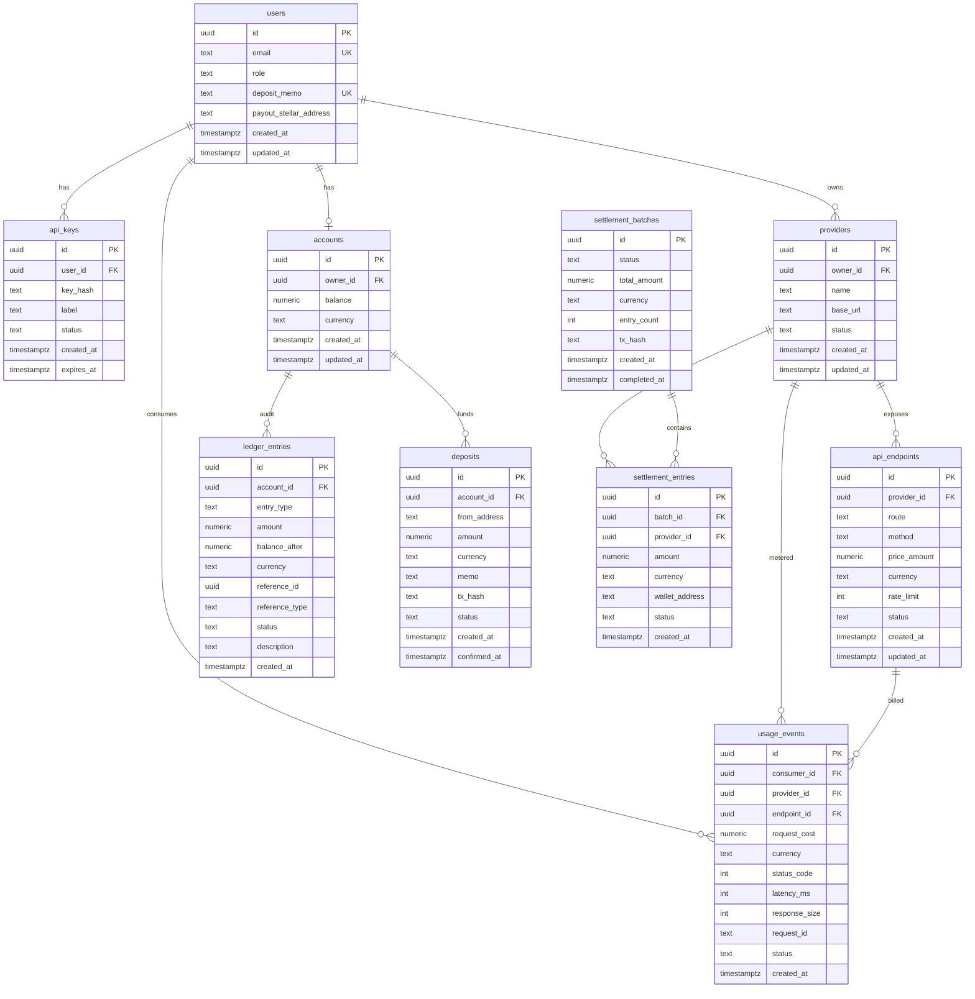

# FlowGate MVP — Entity Relationship Diagram



---

## Cardinality Reference

| Relationship | Type | Meaning |
|---|---|---|
| `users \|\|--o{ api_keys` | 1:N | One user, many API keys |
| `users \|\|--o{ providers` | 1:N | One user, many providers |
| `users \|\|--o\| accounts` | 1:1 | One user, one account |
| `users \|\|--o{ usage_events` | 1:N | One consumer, many usage events |
| `providers \|\|--o{ api_endpoints` | 1:N | One provider, many endpoints |
| `providers \|\|--o{ usage_events` | 1:N | One provider, many usage events |
| `providers \|\|--o{ settlement_entries` | 1:N | One provider, many payout entries |
| `accounts \|\|--o{ ledger_entries` | 1:N | One account, many ledger entries |
| `accounts \|\|--o{ deposits` | 1:N | One account, many deposits |
| `api_endpoints \|\|--o{ usage_events` | 1:N | One endpoint, many usage events |
| `settlement_batches \|\|--o{ settlement_entries` | 1:N | One batch, many settlement entries |

---

## Table Groupings

```
Authentication:     users → api_keys
Gateway Config:     users → providers → api_endpoints
Finance (Internal): users → accounts → ledger_entries, deposits
Finance (On-chain): users.deposit_memo + users.payout_stellar_address (inlined)
Metering:           users + providers + api_endpoints → usage_events
Settlement:         settlement_batches → settlement_entries → providers
```
